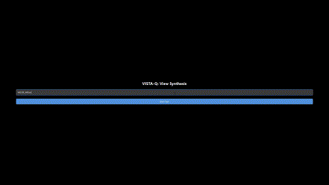

[](https://nodejs.org/)
[](https://threejs.org/)
[](https://www.python.org/)
[](https://pytorch.org/)
[](https://www.gnu.org/licenses/agpl-3.0)

# VISTA-Q Toolkit 
> A Visual Quality of Experience Toolkit for Realistic Immersive Telepresence Applications
<p align="center">
  <table>
    <tr>
      <td align="center">
        <p>Light Field Rating in VR</p>
        
      </td>
      <td align="center">
        <p>360 Video Rating in VR</p>
        
      </td>
    </tr>
    <tr>
      <td align="center">
        <p>View Synthesis Method Rating using Mouse Control</p>
        
      </td>
      <td align="center">
        <p>View Synthesis Method Rating using Face Tracking</p>
        
      </td>
    </tr>
  </table>
</p>

## Table of Contents
- [Overview](#overview)
- [Live Demo](#live-demo)
- [Requirements](#requirements)
- [Quick Setup Guide](#quick-setup-guide)
- [Supported Data Types](#supported-data-types)
- [Results](#results)
- [View-Synthesis Python GUI](#view-synthesis-python-gui)
- [Custom Dataset Support](#custom-dataset-support)
- [Troubleshooting](#troubleshooting)
- [License](#license)
- [Third-Party Licenses](#third-party-licenses)
- [Contact](#contact)

## Overview
VISTA-Q Toolkit is a comprehensive solution for evaluating and analyzing visual quality in immersive telepresence applications. It supports various data types and viewing modes, from basic monocular content to advanced light field imaging.


### Live Demo
- [](https://realistic3d-miun.github.io/Research/VISTA_Q_ToolKit/VISTA_Q_ToolKit.html)

## Requirements
- OpenSSL
- Node.js (v14 or higher recommended)
- Python (v3.7 or higher recommended)
- WebXR Supported Browsers (Chrome, Firefox, Edge)

## Quick Setup Guide

### 1. SSL Certificate Setup
Since WebXR requires HTTPS, generate your SSL/TLS development certificate:

```bash
openssl req -nodes -new -x509 -keyout key.pem -out cert.pem
```

> **Note**: Windows users can use Git-bash to run this command if OpenSSL is not installed.

### 2. Installation
1. Clone the repository:
```bash
git clone https://github.com/Realistic3D-MIUN/VISTA-Q-ToolKit.git
cd VISTA-Q-ToolKit
```

2. Install the required dependencies:
```bash
npm install
```

### 3. Running the Application
Start the WebApp:
```bash
npm start
```

You should see the following confirmation:
```
> VISTA_Q_ToolKit@1.0.0 start
> node app.js
HTTPS server running on port 3000
```

### 4. Accessing the Application
Navigate to any of these URLs:
- https://localhost:3000/
- https://127.0.0.1:3000/
- https://<your_device_ip>:3000

> **Note**: Your browser may mark the page as "unsafe" - select "Advanced" and proceed to continue.

## Supported Data Types

| Data Type              | Desktop | XR Headset Tethered | XR Headset Untethered |
|------------------------|---------|---------------------|----------------------|
| Monocular Image        | ✅      | ✅                  | ✅                   |
| Monocular Video        | ✅      | ✅                  | ✅                   |
| Monocular 360 Image    | ✅      | ✅                  | ✅                   |
| Monocular 360 Video    | ✅      | ✅                  | ✅                   |
| Stereo Image           | ✅      | ✅                  | ✅                   |
| Stereo Video           | ✅      | ✅                  | ✅                   |
| Light Field Image      | ✅      | ✅                  | ❌                   |
| View Synthesis Methods | ✅      | ❌                  | ❌                   |

## Results
* All results are automatically saved in the `./public/Results/` directory
* View Synthesis Evaluation Results are saved in `./ViewSynthesis/Test_Results/` directory

## View-Synthesis Python GUI
The view synthesis feature requires additional Python backend setup. Please refer to the [View Synthesis Setup Guide](/ViewSynthesis/README.md) for detailed instructions.

## Custom Dataset Support

| Data Type             | Documentation                             |
|-----------------------|-------------------------------------------|
| Monocular Image       | [View Guide](/assets/docs/MonoImage.md)   |
| Monocular Video       | [View Guide](/assets/docs/MonoVideo.md)   |
| Monocular 360 Image   | [View Guide](/assets/docs/Mono360Image.md)|
| Monocular 360 Video   | [View Guide](/assets/docs/Mono360Video.md)|
| Stereo Image          | [View Guide](/assets/docs/StereoImage.md) |
| Stereo Video          | [View Guide](/assets/docs/StereoVideo.md) |
| Light Field Image     | [View Guide](/assets/docs/LightField.md)  |
| View Synthesis Models | [View Guide](/ViewSynthesis/Templates/README.md)|

## Troubleshooting

### Common Issues
1. **SSL Certificate Errors**
   - Ensure you've generated the SSL certificate correctly
   - Try clearing your browser cache
   - Check if the certificate is in the correct location

2. **Node.js Dependencies**
   - Try deleting `node_modules` folder and running `npm install` again
   - Check if you have the correct Node.js version installed

3. **WebXR Not Working**
   - Verify you're using a WebXR-compatible browser
   - Check if your browser has the necessary permissions
   - Ensure you're accessing the site via HTTPS
   - Look at the our [detailed guide](/assets/docs/Debugging.md) for SteamVR related issues.

## License
This project is licensed under the GNU Affero General Public License v3.0 (AGPL-3.0) - see the [LICENSE](LICENSE) file for details. This license:
- Allows free use, modification, and distribution
- Requires that any modifications be made available under the same license
- Prevents commercial exploitation without proper licensing
- Ensures that any network service using this software must provide its source code

### Third-Party Licenses
This project uses the following third-party libraries:
- Three.js - [MIT License](https://github.com/mrdoob/three.js/blob/dev/LICENSE)
- Node.js - [MIT License](https://github.com/nodejs/node/blob/main/LICENSE)
- PyTorch - [BSD 3-Clause License](https://github.com/pytorch/pytorch/blob/main/LICENSE)

## Contact
- **Manu Gond**
  - Email: manu.gond@miun.se | manugond45@gmail.com
- **Emin Zerman**
  - Email: emin.zerman@miun.se

---

# Acknowledgements
* We thank authors of [**AdaMPI**](https://github.com/yxuhan/AdaMPI), and [**TMPI**](https://github.com/facebookresearch/TMPI) for their view synthesis model codes which helped verify our ViewSynthesis Model Visualizer.
* We thank [**Erin Alexander**](https://github.com/hypothete/lightfield-webgl2) and authors of [**COLIBRI VR**](https://caor-mines-paristech.github.io/colibri-vr/shader-implementations/disk-based-blending) for their works, which served as the basis of our LF Shader in VR mode.
